# Projeto Integrador
## Entrega 3

### Requisitos
- No cadastro de requisitos, adicionar colunas para o armazenamento da posição geográfica (GPS) de onde o dispositivo móvel se encontra no momento do registro deste requisito e de até duas (2) fotos para cada requisito funcional ou não funcional.
- Nas listagens de projetos e requisitos, disponibilizar um botão para uma nova tela, na qual será possível editar as respectivas informações de um registro.
 
### Ferramentas utilizadas
 - React native
 - Expo client
 - Axios
 - Styled-Components
 - React-Navigation
 
### Demonstração do app

  
  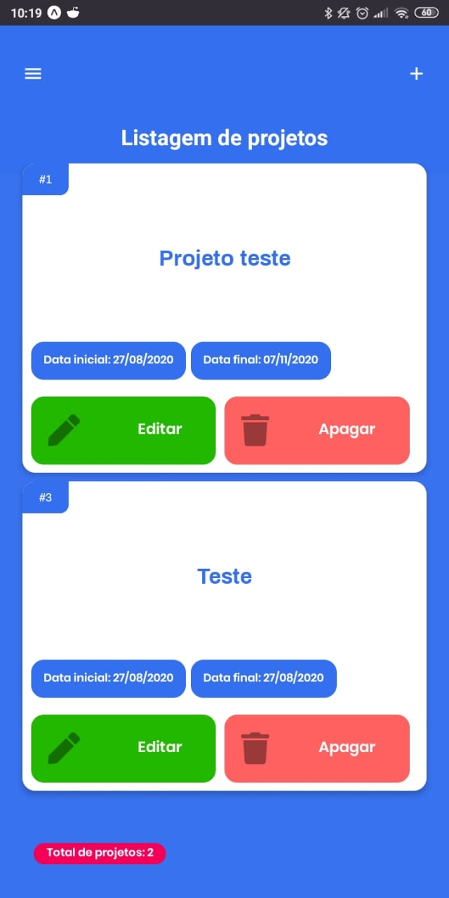
  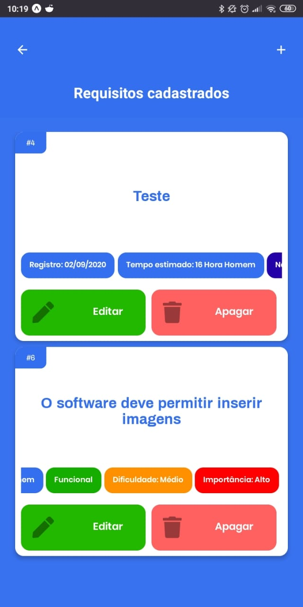
  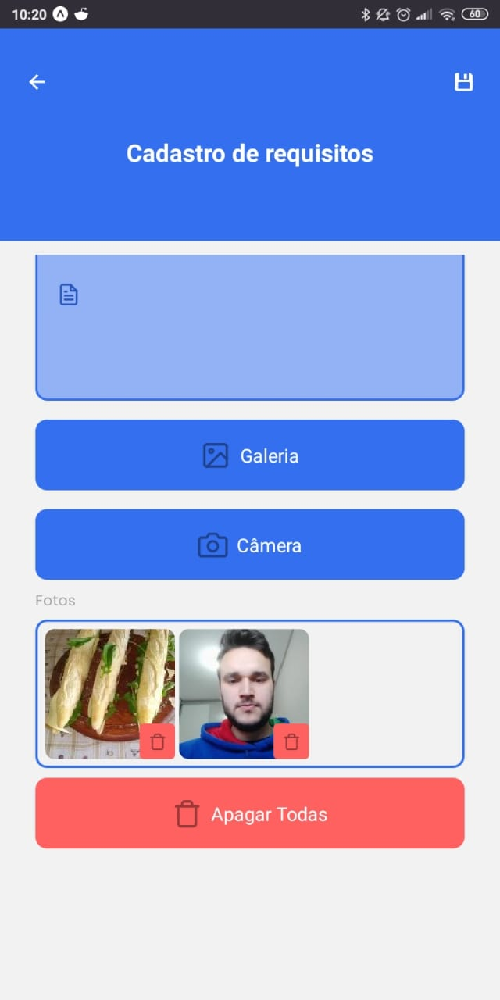
  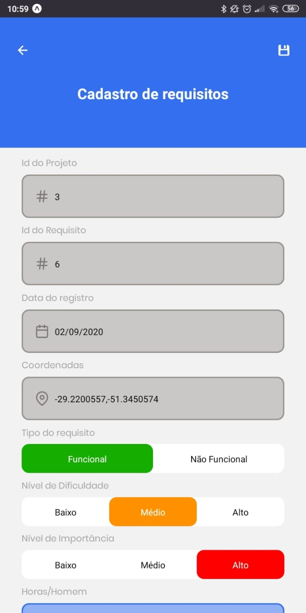
  

## Entrega 2

### Requisitos
- Para cada tela construída em Android (projetos e requisitos), armazenar seus dados em um banco de dados.
- Em Android, construir uma tela que liste os dados de todos os projetos armazenados no banco de dados. 
- Ao selecionar um projeto, listar todos os requisitos armazenados para o respectivo projeto.
- Criar um menu de acesso a cada uma das funcionalidades criadas neste aplicativo.
 
### Ferramentas utilizadas
 - React native
 - Expo client
 - Axios
 - Styled-Components
 - React-Navigation
 
### Demonstração do app

  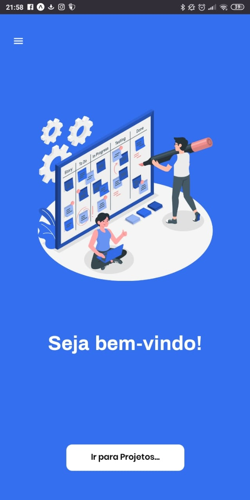
  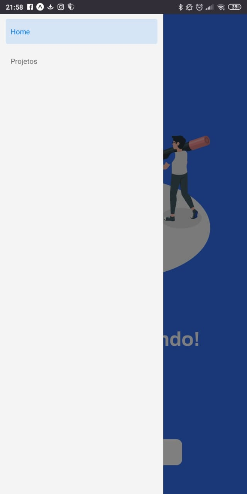
  
  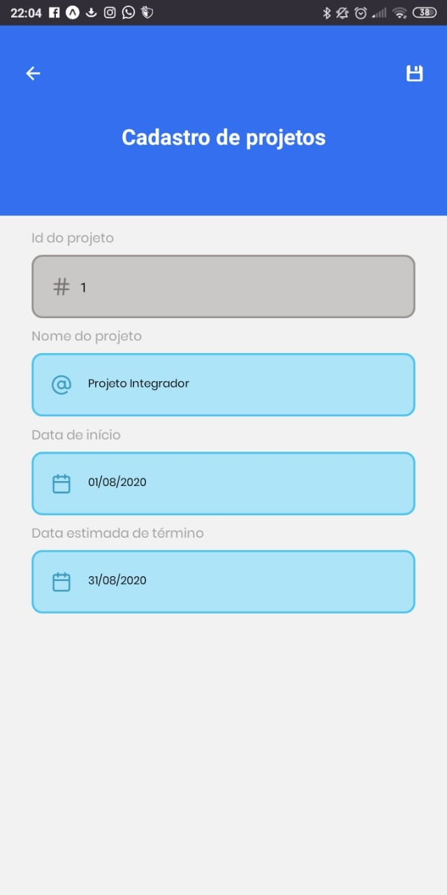
  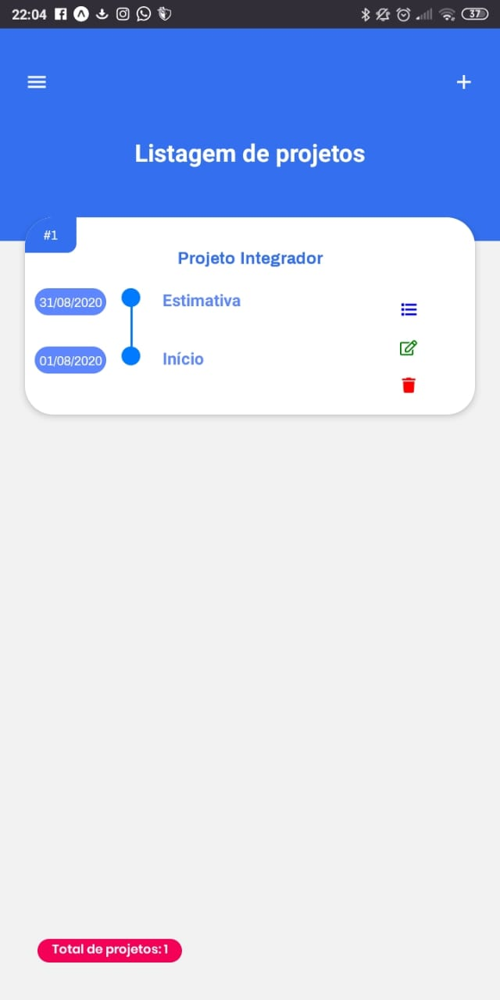
  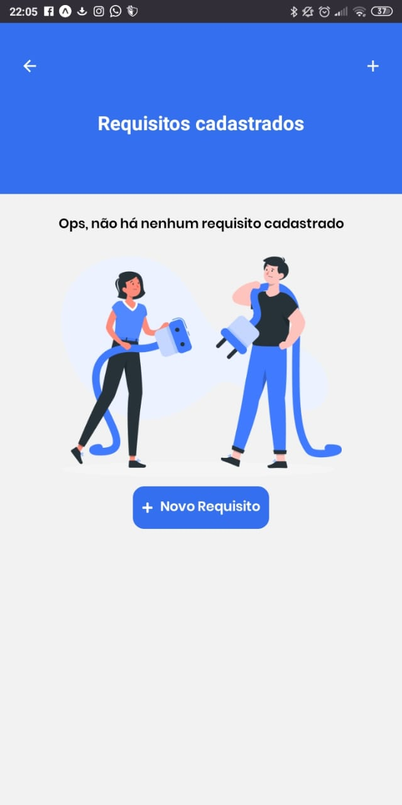
  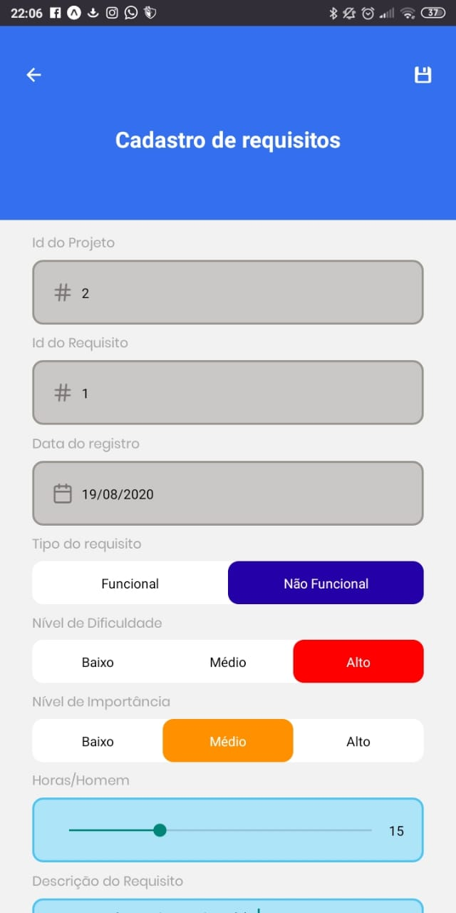
  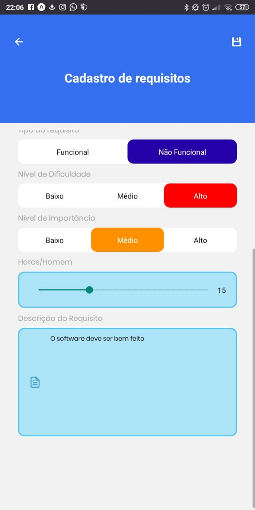
  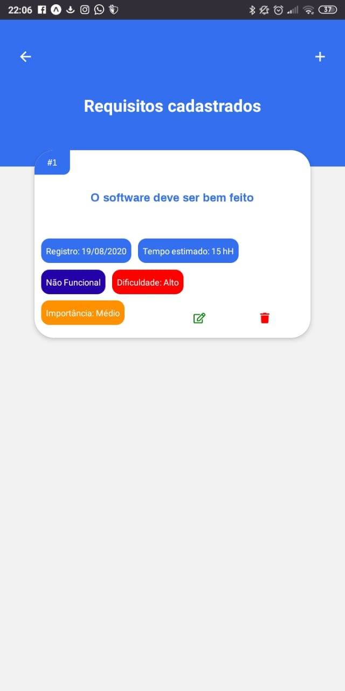

