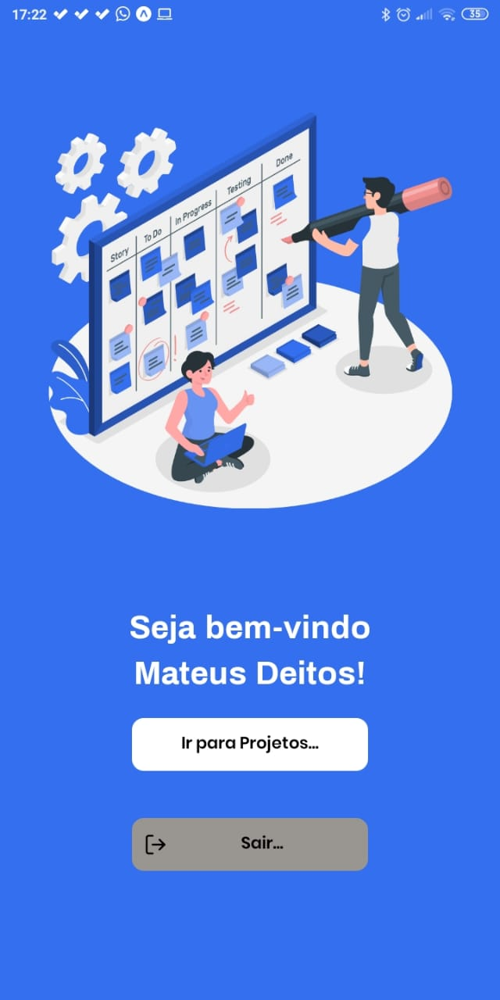
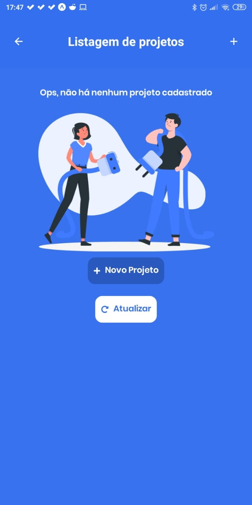
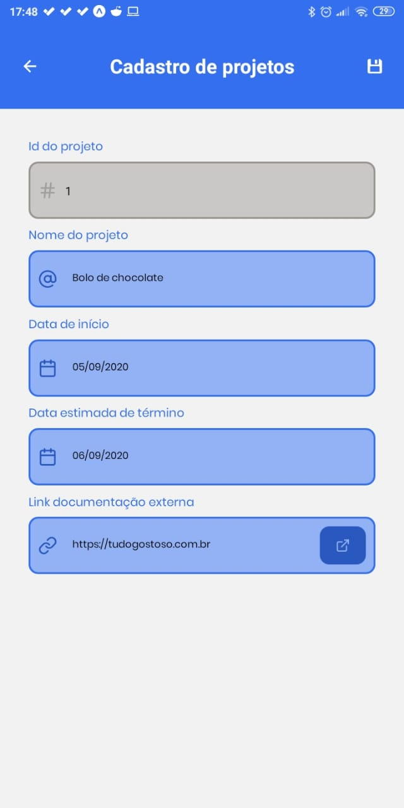
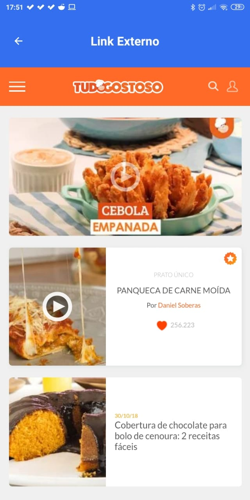
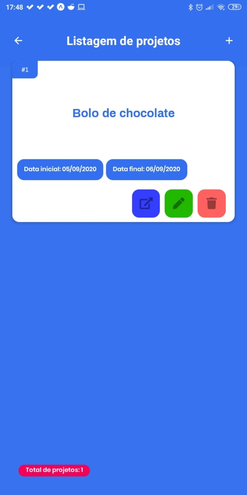
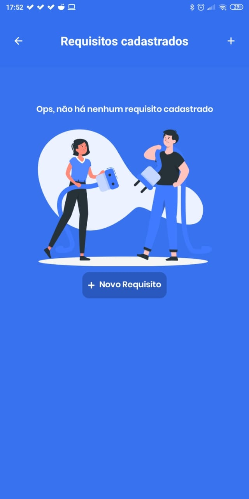
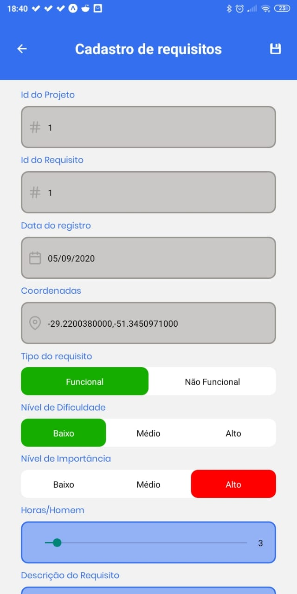
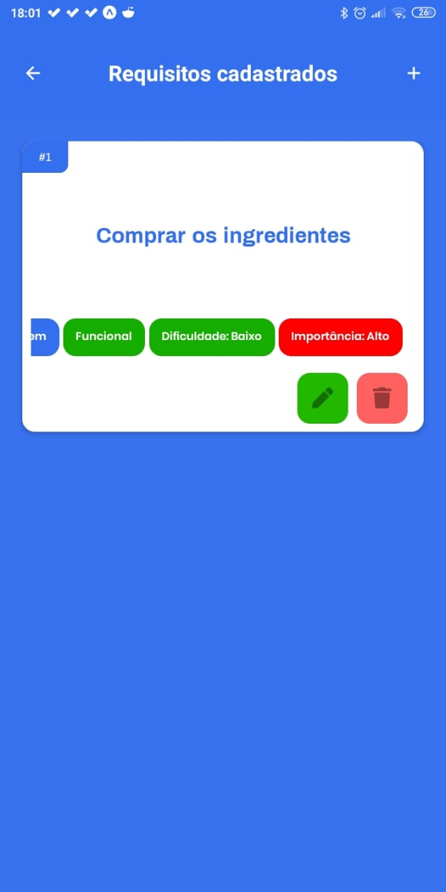

# Projeto Integrador
## Entrega 4

### Requisitos
- No cadastro de “projetos”, adicionar uma coluna para informar um “link para documentação complementar”. Neste link poderá ser indicado, por exemplo, o caminho para acessar uma pasta compartilhada do Google Drive contendo os arquivos do projeto.

- Após o preenchimento deste link no cadastro de projetos, disponibilizar a visualização deste link em uma webview na parte central do aplicativo.

- Para acesso ao aplicativo, construir um cadastro de usuários com senha que terão acesso a todas as funcionalidades e projetos contidos neste aplicativo. Não será necessário diferenciar perfis nos usuários cadastrados.

- Criar uma tela de login para acesso ao aplicativo. As opções de gerenciamento de projetos e requisitos estará disponível apenas para os usuários que conseguiram acesso ao aplicativo.
 
### Ferramentas utilizadas
 - React native
 - Expo client
 - Axios
 - Styled-Components
 - Async Storage
 - Expo Location
 - Expo Camera/ImageLibrary
 - React-Navigation
 - Hook Customizado para criar contexto de Autenticação na aplicação
 - JSON Server como API
 
### Demonstração do app

  
  
  
  
  
  
  
  
  
  
  
  

## Entrega 3

### Requisitos
- No cadastro de requisitos, adicionar colunas para o armazenamento da posição geográfica (GPS) de onde o dispositivo móvel se encontra no momento do registro deste requisito e de até duas (2) fotos para cada requisito funcional ou não funcional.
- Nas listagens de projetos e requisitos, disponibilizar um botão para uma nova tela, na qual será possível editar as respectivas informações de um registro.
 
### Ferramentas utilizadas
 - React native
 - Expo client
 - Axios
 - Styled-Components
 - React-Navigation
 
### Demonstração do app

  
  
  
  
  
  

## Entrega 2

### Requisitos
- Para cada tela construída em Android (projetos e requisitos), armazenar seus dados em um banco de dados.
- Em Android, construir uma tela que liste os dados de todos os projetos armazenados no banco de dados. 
- Ao selecionar um projeto, listar todos os requisitos armazenados para o respectivo projeto.
- Criar um menu de acesso a cada uma das funcionalidades criadas neste aplicativo.
 
### Ferramentas utilizadas
 - React native
 - Expo client
 - Axios
 - Styled-Components
 - React-Navigation
 
### Demonstração do app

  
  
  
  
  
  
  
  
  

