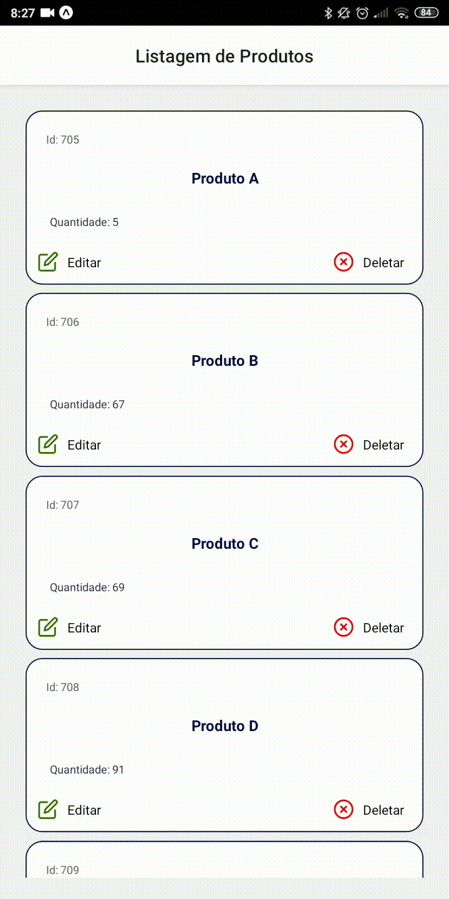
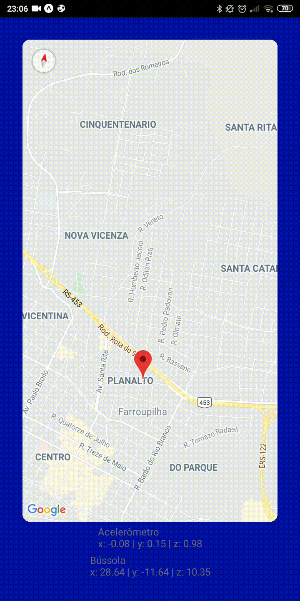
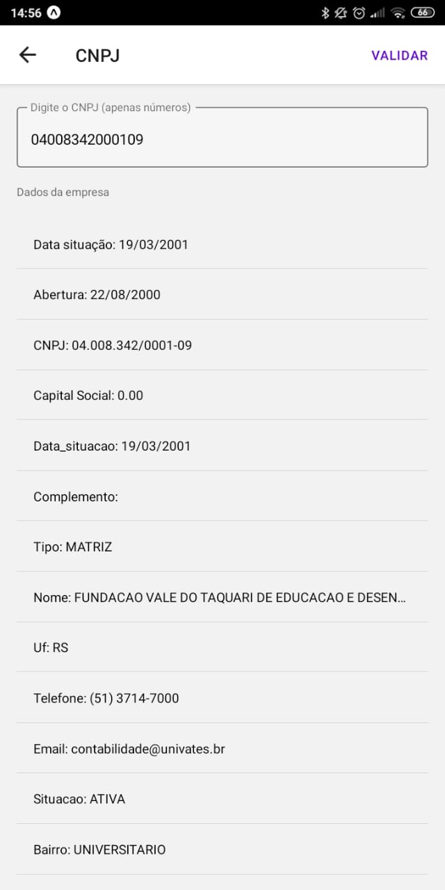
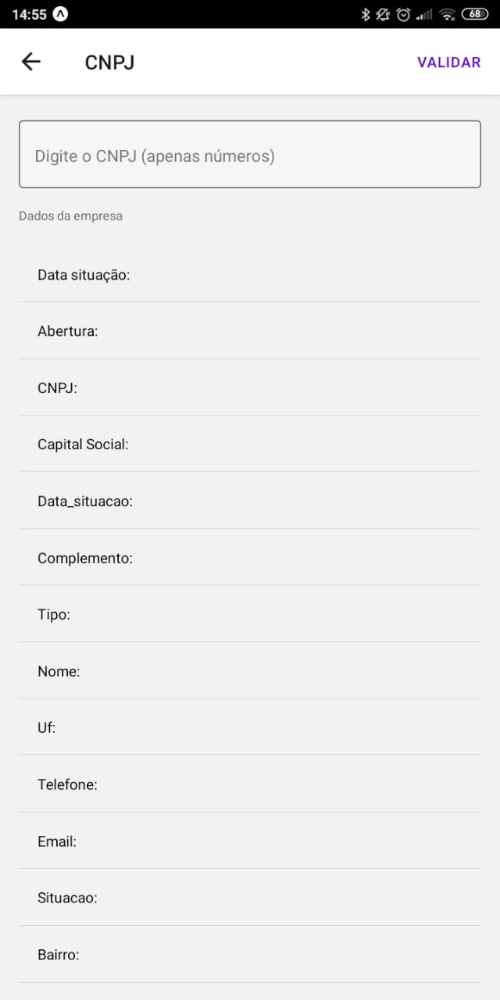
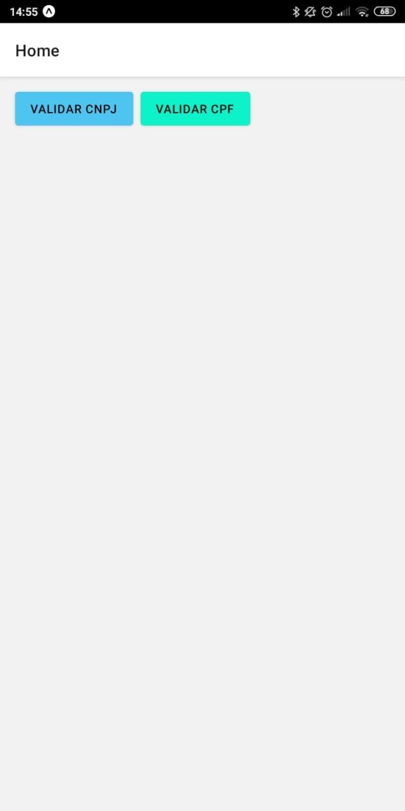

# Tarefa 3

## Requisitos
 - Utilizar SQLite para persistir os dados
 - Fazer uma listagem de itens possibilitando editar/removê-los
 
## Ferramentas utilizadas
 - React native
 - Expo client
 - Expo-SQLite
 - Styled-Components
 - React-Navigation
 - react-native-paper para a Snackbar
 
## Demonstração do app

  

# Tarefa 4

## Requisitos
 - Enviar notificações ao remover produtos
 
## Ferramentas utilizadas
 - React native
 - Expo client
 - Expo-Notifications
 
## Demonstração do app

  

# Tarefa 5

## Requisitos
 - Utilizar os sensores do dispositivo para mover o marcador do mapa
 
## Ferramentas utilizadas
 - React native
 - Expo client
 - Expo-Sensors
 - React native maps
 
## Demonstração do app

  

# Tarefa 6

## Requisitos
 - Validar CNPJ utilizando um webservice
 - Validar CPF redirecionando para o site da Receita Federal
 
## Ferramentas utilizadas
 - React native
 - React Native Paper
 - Expo client
 - Axios
 
## Demonstração do app

  
  
  
  

